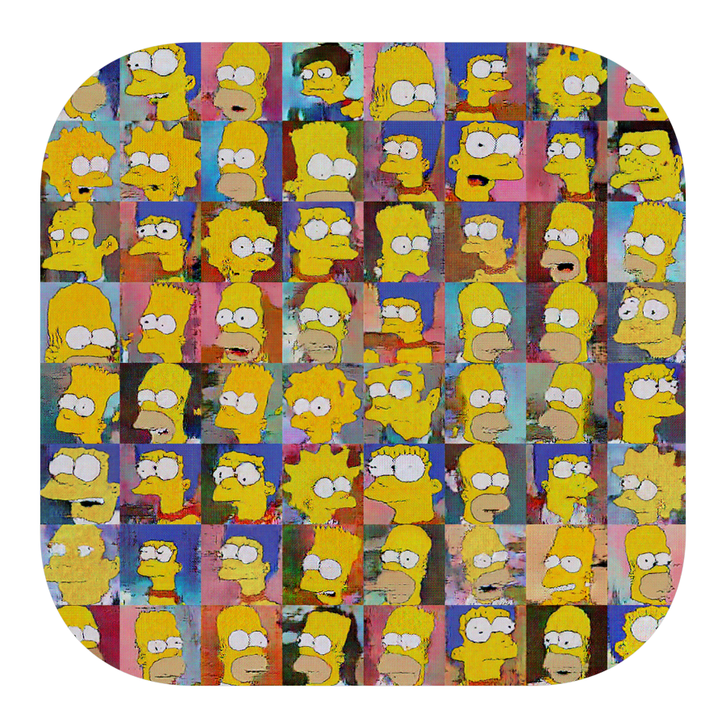
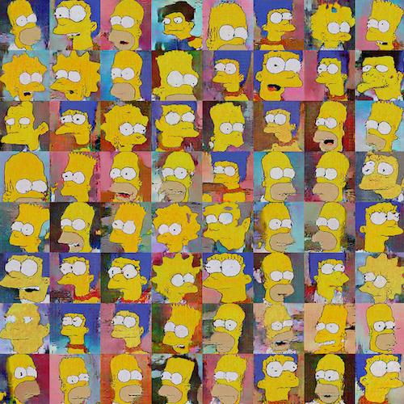
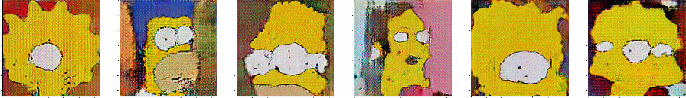

<h3 align="center">
  
</h3>

# Image Generator

Python notebook containing TensorFlow DCGAN implementation. It was trained on a [Simpsons Faces](https://www.kaggle.com/kostastokis/simpsons-faces) dataset.

<h3 align="center">
  
</h3>

## Training
Here is a visualization of training with the following hyperparameteres.

	IMAGE_SIZE = 128
	NOISE_SIZE = 100
	LR_D = 0.00004
	LR_G = 0.0004
	BATCH_SIZE = 64
	EPOCHS = 300
	BETA1 = 0.5
	WEIGHT_INIT_STDDEV = 0.02
	EPSILON = 0.00005

## Results

And some cherry-picked results.

As expected, there were some funny-looking malformed faces as well.
